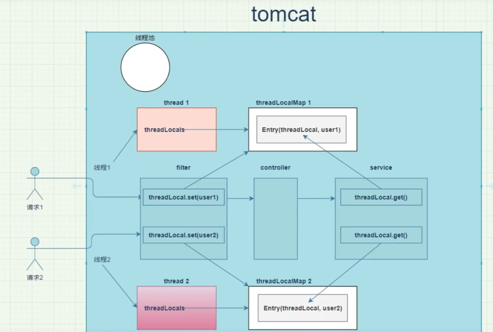

# 博客项目难点

## 1.ThreadLocal的使用

> 在用户登录之后，需要将用户信息存储到上下文，方便提取用户信息

### 1.1拦截器

> 由于部分接口需要使用用户的信息，因此在用户发起请求前，应先对用户信息进行确认

1.当用户信息认证完成后，需要将当前用户信息存入ThreadLocal中，这一操作是在拦截器的preHandle中进行的。

~~~java
@Override
    public boolean preHandle(HttpServletRequest request, HttpServletResponse response, Object handler) throws Exception {
        // TODO 没搞明白
        if((handler instanceof HandlerMethod)) return true;
        // 1.获取请求头中的token
        String token = request.getHeader("Authorization");

        log.info("================request start================");
        log.info("request uri{}",request.getRequestURI());
        log.info("request method:{}",request.getMethod());
        log.info("token{}",token);
        log.info("================ request end================");

        // 2.判断token是否为空，非空则根据token解析出用户信息
        if (StringUtils.isBlank(token)) {
            // 若token为空 则返回错误信息 状态为未登录
            response.setContentType(MediaType.APPLICATION_JSON_UTF8_VALUE);
            response.getWriter().write(JSON.toJSONString(Result.fail(ErrorCode.NO_LOGIN.getCode(), ErrorCode.NO_LOGIN.getMsg())));
            return false;
        }
        // 解析token
        SysUser sysUser = sysUserService.checkToken(token);
        if (sysUser == null) {
            response.setContentType(MediaType.APPLICATION_JSON_UTF8_VALUE);
            response.getWriter().write(JSON.toJSONString(Result.fail(ErrorCode.ACCOUNT_EXPIRED.getCode(), ErrorCode.ACCOUNT_EXPIRED.getMsg())));
            return false;
        }
        // 3.将当前用户存入ThreadLocal中
        UserThreadLocal.put(sysUser);
        return true;
    }
~~~

### **重点**

> ThreadLocal 会将信息存入内存的ThreadLocalMap中，而map的key是弱引用，因此在此次请求结束后key就被gc回收，而value并不会被回收。长久至此，会产生内存泄漏问题。因此需要在此次请求完成后，将本次请求存入内存的key-value都删除

操作很简单:

在拦截器的Interceptor$afterCompletion方法中remove就行

~~~java
    @Override
    public void afterCompletion(HttpServletRequest request, HttpServletResponse response, Object handler, Exception ex) throws Exception {
        // 使用完毕后需要将ThreadLocal中的信息删除，否则会出现内存泄露风险
        UserThreadLocal.remove();
    }
~~~

## 2.线程池的使用
